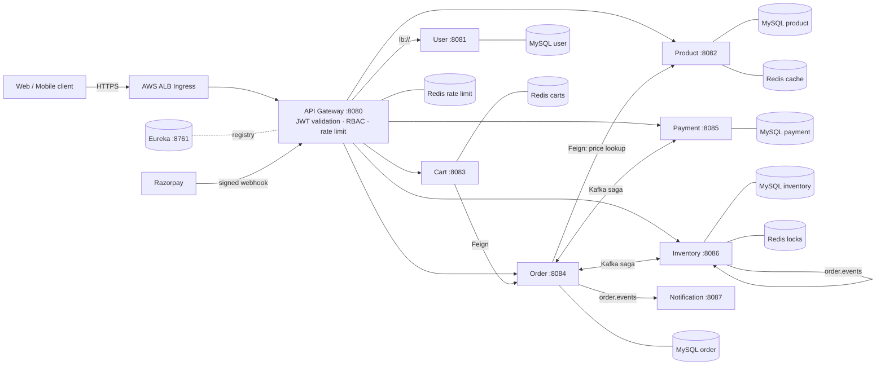
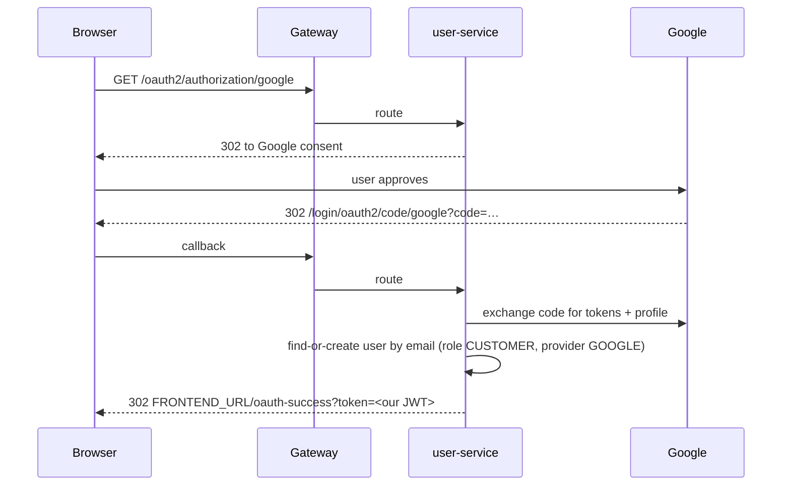
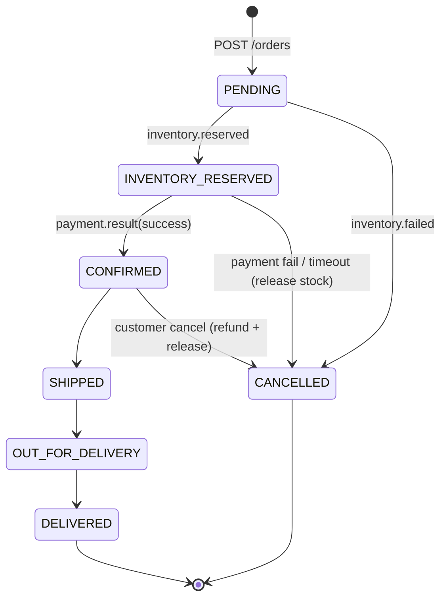
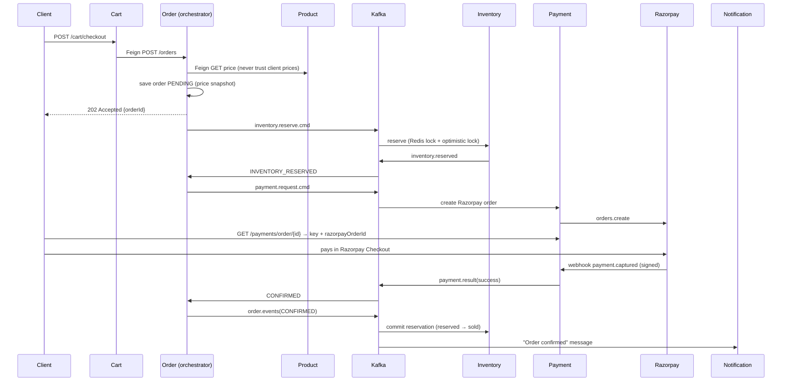
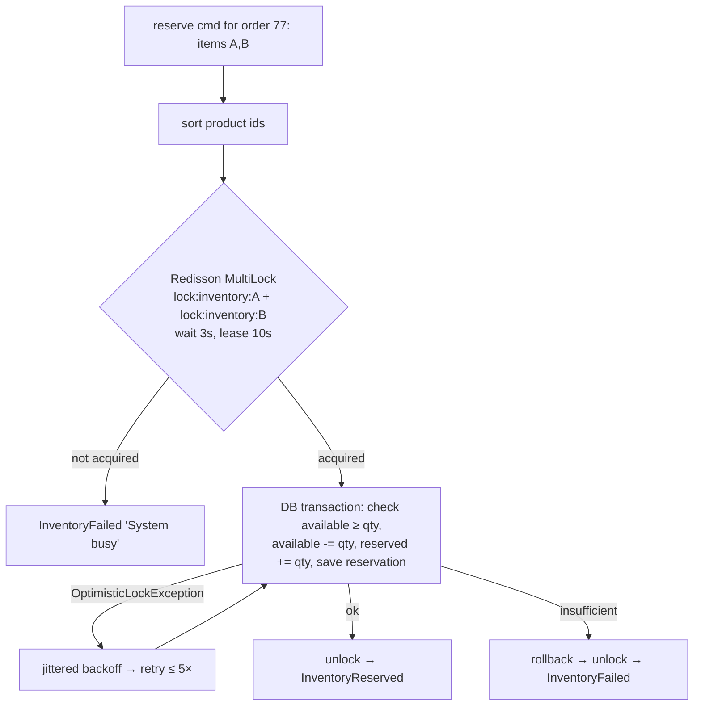
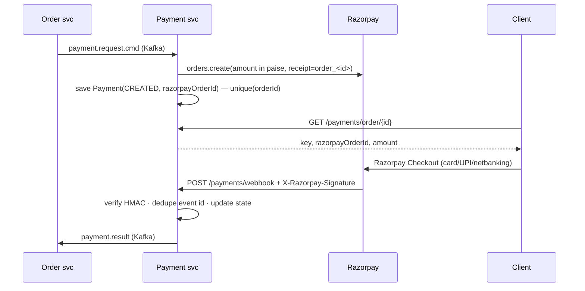
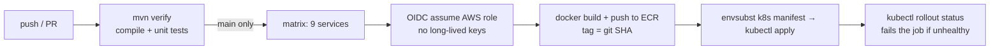

# ShopSphere – Scalable E-Commerce Microservices Platform

A production-style e-commerce backend decomposed into independently deployable microservices. It covers the whole purchase journey – browse → cart → checkout → payment → invoice → delivery tracking – and is built around the problems that actually make e-commerce hard: **data consistency across services, overselling under flash-sale load, read latency on the catalog, safe payment handling, and access control.**

**Stack:** Java 17 · Spring Boot 3.2 · Spring Cloud Gateway · Eureka · OpenFeign · Apache Kafka · Redis (+ Redisson) · MySQL 8 · Spring Security (JWT + OAuth2) · Razorpay · Docker · Kubernetes · GitHub Actions · AWS (EKS, RDS, ElastiCache, MSK, ECR, ALB)

---

## Table of contents
1. [Big picture](#1-big-picture)
2. [Service catalog](#2-service-catalog)
3. [Architecture deep dives](#3-architecture-deep-dives)
   - 3.1 [Microservices & database-per-service](#31-microservices--database-per-service)
   - 3.2 [Service discovery (Eureka)](#32-service-discovery-eureka)
   - 3.3 [API Gateway](#33-api-gateway)
   - 3.4 [Security: JWT, OAuth2, RBAC](#34-security-jwt-oauth2-rbac)
   - 3.5 [Event backbone (Kafka)](#35-event-backbone-kafka)
   - 3.6 [Order lifecycle & Saga orchestration](#36-order-lifecycle--saga-orchestration)
   - 3.7 [Inventory: preventing overselling](#37-inventory-preventing-overselling)
   - 3.8 [Catalog performance: cache, pagination, indexes](#38-catalog-performance-cache-pagination-indexes)
   - 3.9 [Payments with Razorpay](#39-payments-with-razorpay)
   - 3.10 [Cart (Redis)](#310-cart-redis)
   - 3.11 [Notifications](#311-notifications)
4. [Data model](#4-data-model)
5. [API reference](#5-api-reference)
6. [Failure scenarios & how the system reacts](#6-failure-scenarios--how-the-system-reacts)
7. [Running locally](#7-running-locally)
8. [Configuration reference](#8-configuration-reference)
9. [Testing](#9-testing)
10. [Deployment: Docker, Kubernetes, AWS, CI/CD](#10-deployment-docker-kubernetes-aws-cicd)
11. [Observability & operations](#11-observability--operations)
12. [Known limitations & roadmap](#12-known-limitations--roadmap)
13. [Design Q&A](#13-design-qa)
14. [Project structure](#14-project-structure)

---

## 1. Big picture



**Two communication styles are used deliberately:**

| Style | Used for | Why |
|---|---|---|
| **Synchronous REST (via Gateway / OpenFeign)** | Client → services, Cart → Order (checkout), Order → Product (price lookup) | The caller needs an answer *now*. |
| **Asynchronous events (Kafka)** | Everything in the order saga, notifications, refunds | Services are decoupled in time and failure; work is retried, not lost. |

**Request path:** client → Gateway (authenticate, authorise, rate-limit, inject identity headers) → service resolved from Eureka and load-balanced client-side → service reads its own database/cache.

---

## 2. Service catalog

| Service | Port | Datastore | Responsibility | Produces (Kafka) | Consumes (Kafka) |
|---|---|---|---|---|---|
| **discovery-server** | 8761 | – | Eureka registry | – | – |
| **api-gateway** | 8080 | Redis (rate limit) | Single entry, JWT check, RBAC, routing, rate limiting | – | – |
| **user-service** | 8081 | MySQL `shopsphere_user` | Registration, login, Google OAuth2, JWT issuing, role admin | – | – |
| **product-service** | 8082 | MySQL `shopsphere_product`, Redis cache | Catalog CRUD, filtered search, cursor pagination | – | – |
| **cart-service** | 8083 | Redis | Per-user cart, checkout hand-off | – | – |
| **order-service** | 8084 | MySQL `shopsphere_order` | Order lifecycle, **saga orchestrator**, shipment tracking, invoices, expiry job | `inventory.reserve.cmd`, `inventory.release.cmd`, `payment.request.cmd`, `payment.refund.cmd`, `order.events` | `inventory.reserved`, `inventory.failed`, `payment.result` |
| **inventory-service** | 8086 | MySQL `shopsphere_inventory`, Redis (locks) | Stock levels, reservations (reserve / release / commit) | `inventory.reserved`, `inventory.failed` | `inventory.reserve.cmd`, `inventory.release.cmd`, `order.events` |
| **payment-service** | 8085 | MySQL `shopsphere_payment` | Razorpay orders, webhook, refunds, DLQ | `payment.result` | `payment.request.cmd`, `payment.refund.cmd` |
| **notification-service** | 8087 | – | Customer messages on order state changes | – | `order.events` |
| **common** (library) | – | – | Shared event contracts (`Events`, `Topics`) | – | – |

---

## 3. Architecture deep dives

### 3.1 Microservices & database-per-service

**Decomposition rule:** one service per *business capability*, owning the data that capability changes. Boundaries were drawn where different parts of the system have different **scaling profiles** and **consistency needs**:

- Catalog is read-heavy (scale out + cache) while Inventory is write-contended (needs locking) and Payment is correctness-critical (needs idempotency and audit). Putting these in one codebase would force one scaling/locking strategy on all of them.
- Notification is purely reactive and may be slow or fail without ever affecting a customer's order.

**Database-per-service** means no service reads another's tables. Consequences – and how each is handled:

| Consequence | Handling |
|---|---|
| No cross-service JOINs | Order stores a **snapshot** of product name and unit price per line (`order_lines`). Historical orders never change if the catalog changes. |
| No cross-service ACID transaction | **Saga** (§3.6) with compensations. |
| Need another service's data | Synchronous Feign call for reads (Order → Product price), events for state changes. |
| Schema changes are independent | Each service evolves its schema and deploys alone. (Locally one MySQL container hosts 5 logical databases; in AWS use one RDS instance/schema per service.) |

`common` holds **only event contracts** (Java records). It deliberately contains no business logic so services stay independently deployable; a contract change is a versioned library bump.

### 3.2 Service discovery (Eureka)

Pods in Kubernetes get new IPs on every restart, so no service hard-codes another's address. Each service registers with Eureka (`spring.application.name`, `prefer-ip-address: true`) and sends heartbeats. Callers use logical names:

- Gateway routes use `lb://PRODUCT-SERVICE`.
- Feign clients are declared as `@FeignClient(name = "ORDER-SERVICE")`.

Spring Cloud LoadBalancer resolves the name to the list of healthy instances from its cached registry copy and round-robins between them (**client-side load balancing** – no extra network hop). If Eureka goes down, services keep working from their last cached registry.

> On Kubernetes you could replace Eureka with native Kubernetes Services/DNS. Eureka is kept here to demonstrate the Spring Cloud pattern and so the same code runs under plain Docker Compose.

### 3.3 API Gateway

Spring Cloud Gateway (reactive, Netty) is the **only** publicly exposed component. Responsibilities:

1. **Routing** – path-based: `/api/auth|users|admin|oauth2` → user, `/api/products` → product, `/api/cart` → cart, `/api/orders` → order, `/api/payments` → payment, `/api/inventory` → inventory.
2. **Authentication** – `JwtAuthFilter` (a `GlobalFilter`) validates the `Authorization: Bearer` JWT signature and expiry once, centrally. Downstream services never parse tokens.
3. **Coarse authorisation (RBAC)** – see matrix in §3.4.
4. **Identity propagation** – after validation the filter **removes any client-supplied** `X-User-Id / X-User-Role / X-User-Email` headers (prevents header spoofing) and injects trusted ones from the token claims. Services read identity from these headers.
5. **Rate limiting** – Spring's `RequestRateLimiter` using the Redis **token-bucket** algorithm: each caller key gets a bucket that refills at **20 tokens/s** with **burst capacity 40**; an empty bucket returns `429 Too Many Requests`. The key is the bearer token (so each logged-in user has their own bucket) or the client IP for anonymous traffic (`RateLimitConfig.userKeyResolver`). Redis makes the limit **shared across all gateway replicas**.
6. **Public routes** (no JWT): `/api/auth/**`, `/oauth2/**`, `/login/oauth2/**`, `GET /api/products/**`, `POST /api/payments/webhook` (authenticated by HMAC signature instead), `/actuator/health`.

**Trust model:** the gateway is the trust boundary. Downstream services trust the identity headers, therefore in Kubernetes they must be reachable only from inside the cluster (ClusterIP services; only the gateway is behind the ALB Ingress). See roadmap for NetworkPolicies and service-to-service tokens.

### 3.4 Security: JWT, OAuth2, RBAC

**JWT** (HS256, 1-hour expiry), issued by `user-service`:

```json
{ "sub": "42", "email": "sam@shop.com", "role": "SELLER", "iat": 1735000000, "exp": 1735003600 }
```

The same `JWT_SECRET` is configured for user-service (sign) and the gateway (verify). Stateless – no session lookup on the hot path.

**Local login:** `POST /api/auth/register` (BCrypt-hashed password, role can only be `CUSTOMER` or `SELLER` – **ADMIN can never self-register**) and `POST /api/auth/login`.

**OAuth2 social login (Google):**


Google only proves identity; the platform then issues **its own** JWT so every client path (password or social) ends in the same token format.

**RBAC matrix**

| Capability | Anonymous | CUSTOMER | SELLER | ADMIN |
|---|:-:|:-:|:-:|:-:|
| Browse / search products | ✅ | ✅ | ✅ | ✅ |
| Cart, checkout, own orders, cancel, invoice | – | ✅ | ✅ | ✅ |
| Create/update/delete products | – | ❌ | ✅ own products | ✅ all |
| Set stock levels | – | ❌ | ✅ | ✅ |
| Advance shipment status | – | ❌ | ✅ | ✅ |
| View other users' orders | – | ❌ | ✅ | ✅ |
| Change user roles (`/api/admin/**`) | – | ❌ | ❌ | ✅ |

Enforcement is **layered**: the gateway blocks by path/role (coarse), and services enforce **ownership** (fine) – e.g. product-service checks `product.sellerId == X-User-Id` unless ADMIN; order-service lets a CUSTOMER read only their own order.

### 3.5 Event backbone (Kafka)

**Topics** (3 partitions each, created by `KafkaTopicsConfig`):

| Topic | Producer → Consumer | Payload |
|---|---|---|
| `inventory.reserve.cmd` | order → inventory | `ReserveInventoryCmd(orderId, items[])` |
| `inventory.reserved` | inventory → order | `InventoryReserved(orderId)` |
| `inventory.failed` | inventory → order | `InventoryFailed(orderId, reason)` |
| `inventory.release.cmd` | order → inventory | `ReleaseInventoryCmd(orderId)` |
| `payment.request.cmd` | order → payment | `PaymentRequest(orderId, userId, amount)` |
| `payment.result` | payment → order | `PaymentResult(orderId, success, paymentId, reason)` |
| `payment.refund.cmd` | order → payment | `RefundCmd(orderId)` |
| `order.events` | order → notification, inventory | `OrderEvent(orderId, userId, email, status, total)` |
| `payment.request.cmd.DLT`, `payment.refund.cmd.DLT` | payment → (ops) | dead-lettered messages |

**Naming:** `*.cmd` = a command ("do this", one owner), others = events/replies ("this happened").

**Design choices**
- **Message key = `orderId`** → all messages of one order land on the same partition → processed **in order**; different orders spread across partitions for parallelism.
- **JSON serialisation** with Spring's `JsonSerializer/JsonDeserializer`; the Java type travels in a header and deserialisation is restricted to `com.shopsphere.common.events` (trusted packages – prevents arbitrary class instantiation).
- **At-least-once delivery** is assumed everywhere → **every consumer is idempotent** (state checks, unique keys, PK on `orderId`).
- **Consumer groups** are named after the service, so each service instance group gets every message once, and replicas of one service share the work.
- **Dead Letter Queue** (payment-service): `DefaultErrorHandler` retries a failing record 3 times (1 s apart); if it still fails, `DeadLetterPublishingRecoverer` publishes it to `<topic>.DLT` with the exception in headers, so a poison message never blocks the partition and is never silently lost.

### 3.6 Order lifecycle & Saga orchestration

#### The problem
Placing an order touches three services with three databases (Order, Inventory, Payment). A distributed lock or two-phase commit would couple them, block on failures and not scale. Instead we use the **Saga pattern**: a sequence of **local** transactions, each followed by an event, with **compensating actions** that undo earlier steps if a later one fails.

#### Orchestration vs choreography
This project uses **orchestration**: `order-service` (`OrderSagaOrchestrator`) is the single brain that knows the workflow and sends commands; participants only do their step and reply. Compared to choreography (services reacting to each other's events) the flow is visible in one class, easier to test, and easier to add steps/timeouts to.

#### State machine


#### Happy path

`POST /orders` returns **202 Accepted** because the saga continues asynchronously; clients poll `GET /orders/{id}` (or receive a notification).

#### Compensation table
| Failure point | What happened | Compensation |
|---|---|---|
| Stock insufficient / product unknown | `inventory.failed` | Order → `CANCELLED` (nothing was reserved, nothing to undo) |
| Customer never pays / abandons | No `payment.result` within **15 min** | `OrderExpiryJob` (every 60 s) → `expire()` → `inventory.release.cmd` + `CANCELLED` |
| Payment declined | `payment.result(success=false)` | `inventory.release.cmd` + `CANCELLED` |
| Customer cancels before paying | `POST /orders/{id}/cancel` | release stock + `CANCELLED` |
| Customer cancels after paying (before shipping) | cancel on `CONFIRMED` | `payment.refund.cmd` (auto-refund) + release stock + `CANCELLED` |
| Payment captured **after** the order expired | late `payment.result(success)` on a `CANCELLED` order | automatic `payment.refund.cmd` – customer is never charged for nothing |

#### Idempotency – why duplicates are harmless
Kafka may redeliver. Each handler first checks the current state:
- `onReserved` acts only if status is `PENDING`.
- `onPayment` acts only if `INVENTORY_RESERVED` (or handles the late-payment case).
- `cancel()` returns immediately if already `CANCELLED`.
- Inventory `reserve` is a no-op if a reservation for that `orderId` exists (PK).
- Payment creation is a no-op if a payment for that `orderId` exists (unique constraint).
- Refund runs only if payment status is `CAPTURED` (then becomes `REFUNDED`).

#### Delivery tracking, invoice
`PATCH /orders/{id}/shipment?status=` (SELLER/ADMIN) walks `CONFIRMED → SHIPPED → OUT_FOR_DELIVERY → DELIVERED`; illegal jumps return `409`. Every transition publishes `order.events`, which feeds notifications. `GET /orders/{id}/invoice` returns invoice number (`INV-00000012`), line items (from the price snapshot), total and tax component; available only for non-pending, non-cancelled orders.

> **Known gap (documented honestly):** a state change is saved to MySQL and then the Kafka message is sent; if the process dies between the two, the event is lost. The production fix is the **transactional outbox** pattern (see roadmap). The expiry job already limits the blast radius for the money-critical path.

### 3.7 Inventory: preventing overselling

**Scenario:** a flash sale puts 10 000 requests/second on a SKU with 100 units. Naïve "read stock, check, write stock" lets many requests read `100` simultaneously and all succeed → sold 400 units that don't exist.

**Two cooperating layers** (`InventoryFacade` + `ReservationTx`):



| Layer | Purpose | Why it is not enough alone |
|---|---|---|
| **Redis distributed lock (per product)** | Serialises contention across *all pods*, so the database sees an orderly queue instead of a stampede; fails fast ("busy") when overloaded. | A lock has a **lease** – if a pod pauses (GC, network) past the lease the lock expires and a second writer can enter. Locks alone are not a correctness guarantee. |
| **Optimistic locking (`@Version`)** | The *correctness* guarantee: `UPDATE stock … WHERE product_id=? AND version=?` – if someone else changed the row, the update affects 0 rows and Hibernate throws; we retry with fresh data. | Under heavy contention it causes many retries/rollbacks – which the Redis lock prevents. |

Details that matter:
- **Sorted lock acquisition** → two orders for `(A,B)` and `(B,A)` can never deadlock.
- **All-or-nothing:** all lines of an order are reserved in **one** DB transaction; one short line rolls everything back.
- **Reservation model, not direct decrement:** `available` → `reserved` on reserve; `reserved` → sold on **commit** (when `order.events` says `CONFIRMED`); `reserved` → `available` on **release** (compensation). Each reservation row has a state (`RESERVED/COMMITTED/RELEASED`) so replays of release/commit are no-ops.
- Unlock is guarded against `IllegalMonitorStateException` when the lease already expired.

### 3.8 Catalog performance: cache, pagination, indexes

Three independent techniques are combined for the reported **~65 % latency reduction** (measure it yourself – see §9 for the load-test recipe):

**1) Redis caching with TTL-based invalidation** (`CacheConfig`, `ProductService`)

| Cache | Key | TTL | Invalidation |
|---|---|---|---|
| `product` | product id | 30 min | evicted on update/delete of that product |
| `productList` | hash of (cursor, category, brand, min, max, q, limit) | 2 min | **all entries** evicted on any create/update/delete; short TTL as safety net |

Cache-aside via Spring's `@Cacheable/@CacheEvict`. Values are serialised `Serializable` records. Lists have a short TTL because they are affected by *any* change; single products tolerate longer.

**2) Cursor (keyset) pagination** (`ProductRepository.page`)

`OFFSET 100000 LIMIT 20` forces MySQL to read and discard 100 000 rows – cost grows with page depth. Keyset pagination uses `WHERE id > :cursor ORDER BY id LIMIT 20`, a primary-key range seek, **constant cost at any depth** and stable when rows are inserted concurrently. The response contains `nextCursor` (null on the last page); the client sends it back as `cursor`.

**3) Composite MySQL indexes** (`@Table(indexes=…)` on `Product`)

| Index | Serves |
|---|---|
| `(category, brand, price)` | The common filter `category = ? [AND brand = ?] [AND price BETWEEN ? AND ?]`. Follows the *leftmost-prefix rule*: usable for `category`, `category+brand`, `category+brand+price`. Equality columns first, range column (`price`) last. |
| `(sellerId)` | Seller dashboards |
| `(name)` | Prefix search `name LIKE 'iph%'` |

Verify with `EXPLAIN SELECT …` (look for `type=range/ref`, `key=idx_cat_brand_price`, no `Using filesort`). For true full-text search plan OpenSearch (roadmap).

### 3.9 Payments with Razorpay



**Why a webhook and not the browser callback?** The browser can close, lose network, or be tampered with. The webhook is a server-to-server notification and the source of truth.

**Safeguards**

| Risk | Control |
|---|---|
| Forged webhook | **HMAC-SHA256 signature** of the **raw request body** with the webhook secret (`Utils.verifyWebhookSignature`). The endpoint takes the body as a raw `String` – parsing JSON first would change the bytes and break verification. Invalid → `400`. |
| Webhook delivered twice (Razorpay retries) | `X-Razorpay-Event-Id` stored in `processed_webhook_events` (PK) – duplicates ignored. Also state check: only `CREATED → CAPTURED` once. |
| Duplicate Razorpay order for one order (Kafka redelivery) | **Idempotency key = `orderId`** (unique constraint + existence check). |
| Customer's first attempt fails, second succeeds | `payment.failed` only logs. Razorpay Checkout allows retries on the same Razorpay order; failing the saga on the first attempt would cancel an order the customer then pays for. The expiry job ends abandoned orders. |
| Paid too late / order cancelled | Automatic refund (see §3.6). |
| Poison/failed Kafka message | 3 retries → `payment.*.DLT`. |
| Money precision | `BigDecimal`; converted to paise with `movePointRight(2).longValueExact()` (throws rather than rounding silently). |

**Refunds** – `payment.refund.cmd` → `payments.refund(paymentId, amount)`; payment becomes `REFUNDED`; refund id stored. Only runs while status is `CAPTURED`, so retries cannot refund twice.

**Mock mode for local development:** `RAZORPAY_MOCK=true` (default in Docker Compose) skips Razorpay API calls (order id becomes `mock_<orderId>`) but **still verifies webhook signatures**, so `scripts/smoke-test.sh` exercises the entire flow with no Razorpay account. Set it to `false` and supply test keys for the real sandbox; expose your local webhook with ngrok and register `https://<host>/api/payments/webhook` for `payment.captured` and `payment.failed`.

### 3.10 Cart (Redis)

A cart is temporary, per-user, written and read constantly and doesn't need relational integrity – a Redis **hash** `cart:{userId}` (`field = productId`, `value = quantity`) fits. `HINCRBY` makes "add item" atomic (no read-modify-write race); a **7-day TTL** (refreshed on change) removes abandoned carts automatically. Checkout reads the cart, calls Order via Feign (`connect 2 s / read 5 s` timeouts), then deletes the cart. Prices are **never** stored in the cart – Order Service reads current prices from Product Service at checkout.

### 3.11 Notifications

`notification-service` consumes `order.events` and renders messages for `CONFIRMED / SHIPPED / OUT_FOR_DELIVERY / DELIVERED / CANCELLED`. It only logs the e-mail in this repo; replace the log call with `JavaMailSender`, AWS SES or SNS. Because it is a pure consumer, an outage or slow mail provider can never affect order processing – Kafka simply retains messages until it catches up.

---

## 4. Data model

| Service | Table | Key columns / notes |
|---|---|---|
| user | `users` | `id`, `email` (unique), `password_hash` (null for social), `role`, `provider` |
| product | `products` | `id`, `seller_id`, `name`, `category`, `brand`, `price`; indexes above |
| order | `orders` | `id`, `user_id`, `status`, `total`, `shipping_address`, `cancel_reason`, timestamps; index `(user_id, created_at)` |
| order | `order_lines` | `order_id`, `product_id`, `product_name`, `quantity`, `unit_price` (snapshot) |
| inventory | `stock` | `product_id` PK, `available`, `reserved`, **`version`** |
| inventory | `reservations`, `reservation_lines` | `order_id` PK (idempotency), `state` |
| payment | `payments` | `order_id` **unique**, `razorpay_order_id` unique, `razorpay_payment_id`, `refund_id`, `amount`, `status` |
| payment | `processed_webhook_events` | `event_id` PK |

Schemas are created by Hibernate (`ddl-auto: update`) for convenience; for production use Flyway/Liquibase migrations and `ddl-auto: validate`.

---

## 5. API reference
All through the gateway at `http://localhost:8080`. `🔒` = needs `Authorization: Bearer <JWT>`.

| Method & path | Role | Description |
|---|---|---|
| `POST /api/auth/register` | public | `{name,email,password,role?}` → `{token}` |
| `POST /api/auth/login` | public | `{email,password}` → `{token}` |
| `GET /oauth2/authorization/google` | public | Start Google login |
| `GET /api/users/me` 🔒 | any | Current profile |
| `PUT /api/admin/users/{id}/role?role=` 🔒 | ADMIN | Change role |
| `GET /api/products` | public | Filters: `category, brand, minPrice, maxPrice, q, cursor, limit(≤50)` → `{items, nextCursor}` |
| `GET /api/products/{id}` | public | Product detail (cached) |
| `POST/PUT/DELETE /api/products[/{id}]` 🔒 | SELLER, ADMIN | Manage catalog (owner or admin) |
| `PUT /api/inventory/{productId}?available=` 🔒 | SELLER, ADMIN | Set stock |
| `GET /api/inventory/{productId}` 🔒 | SELLER, ADMIN | Stock view |
| `GET /api/cart` 🔒 | any | View cart |
| `POST /api/cart/items` 🔒 | any | `{productId, quantity}` |
| `DELETE /api/cart/items/{productId}` 🔒 | any | Remove line |
| `POST /api/cart/checkout` 🔒 | any | `{shippingAddress}` → creates order (`202`) |
| `GET /api/orders` / `GET /api/orders/{id}` 🔒 | owner/staff | List / detail (status shows saga progress) |
| `POST /api/orders/{id}/cancel` 🔒 | owner | Cancel (auto-refund if paid) |
| `PATCH /api/orders/{id}/shipment?status=` 🔒 | SELLER, ADMIN | `SHIPPED → OUT_FOR_DELIVERY → DELIVERED` |
| `GET /api/orders/{id}/invoice` 🔒 | owner/staff | Invoice JSON |
| `GET /api/payments/order/{orderId}` 🔒 | any | Params for Razorpay Checkout |
| `POST /api/payments/webhook` | signature | Razorpay → platform |

Status codes: `202` async accepted, `400` bad webhook signature, `401` missing/invalid JWT, `403` role/ownership, `404` not found, `409` illegal state transition, `429` rate limited.

---

## 6. Failure scenarios & how the system reacts

| Scenario | Behaviour |
|---|---|
| Inventory service down | Reserve commands wait in Kafka; order stays `PENDING`; processed on recovery; expiry job cancels it if too late. |
| Payment service down / Razorpay API error | `payment.request.cmd` retried 3× then dead-lettered; order expires and stock is released. |
| Kafka message processed twice | Idempotent handlers (§3.6) – no double reserve/charge/refund. |
| Two shoppers buy the last unit | Lock serialises; second sees `available=0` → `inventory.failed` → order cancelled. |
| Redis lock lease expires mid-operation | `@Version` check makes the stale writer fail and retry – no oversell. |
| Redis (cache) down | Product reads fall back to MySQL (slower, still correct); rate limiter/cart/locks are affected – production should run ElastiCache with replicas. |
| Webhook arrives twice / out of order | Event-id dedupe + status guards. |
| Customer pays after expiry | Auto-refund. |
| Forged webhook / forged identity headers | Rejected by HMAC / stripped by gateway. |
| Traffic spike from one client | Token bucket returns `429` to that client only. |
| Pod crash | Kubernetes restarts it; readiness/liveness probes keep traffic away from unready pods; consumers resume from committed offsets. |

---

## 7. Running locally

**Prerequisites:** JDK 17, Maven 3.9+, Docker & Docker Compose, `jq` + `openssl` (for the smoke test).

```bash
cp .env.example .env                       # RAZORPAY_MOCK=true works with no keys
mvn clean package                          # builds all modules and runs unit tests
docker compose up --build                  # MySQL, Redis, Kafka, Eureka, gateway + 7 services
# wait ~60-90 s until all services show UP at http://localhost:8761
./scripts/smoke-test.sh                    # end-to-end: register → product → stock → cart → checkout → webhook → ship → invoice → oversell check
```
Expected smoke-test outcome: order `CONFIRMED` after the signed webhook, `DELIVERED` after shipment steps, the forged webhook returns `HTTP 400`, and the 10-unit order is `CANCELLED` with `Insufficient stock…`.

Make an admin: `docker compose exec mysql mysql -uroot -proot -e "UPDATE shopsphere_user.users SET role='ADMIN' WHERE email='you@x.com'"`.

Running a single service from the IDE: start MySQL/Redis/Kafka via compose (`docker compose up mysql redis kafka`) and run the Spring Boot class; defaults point to `localhost`.

---

## 8. Configuration reference
Every setting has a default for local use and is overridable by environment variable.

| Variable | Default | Used by |
|---|---|---|
| `DB_HOST`, `DB_USER`, `DB_PASS` | `localhost`, `root`, `root` | user, product, order, payment, inventory |
| `REDIS_HOST` | `localhost` | gateway, product, cart, inventory |
| `KAFKA_SERVERS` | `localhost:9092` | order, payment, inventory, notification |
| `EUREKA_URL` | `http://localhost:8761/eureka` | all |
| `JWT_SECRET` | dev placeholder (**change!**, ≥32 chars) | user, gateway |
| `RAZORPAY_KEY_ID / KEY_SECRET / WEBHOOK_SECRET` | placeholders | payment |
| `RAZORPAY_MOCK` | `false` (`true` in compose) | payment |
| `GOOGLE_CLIENT_ID / GOOGLE_CLIENT_SECRET` | `dummy` | user |
| `FRONTEND_URL` | `http://localhost:3000` | user (OAuth redirect) |
| `order.expiry-minutes` / `order.expiry-check-ms` | `15` / `60000` | order |
| `kafka.replicas` | `1` (use 3 on MSK) | order (topic creation) |

---

## 9. Testing
`mvn test` runs fast unit tests that need **no infrastructure**:

| Test | Proves |
|---|---|
| `ReservationTxTest` | reserve moves stock, insufficient stock rejected & nothing saved, replay is idempotent, release/commit are one-shot |
| `OrderSagaOrchestratorTest` | duplicate `reserved` sends one payment request; failure/timeout/cancel compensations; late payment refunded |
| `PaymentWebhookTest` | forged signature rejected, capture publishes result, duplicate event ignored, failed attempt doesn't fail the order |
| `JwtServiceTest` | token claims; token signed with another key is rejected |

`scripts/smoke-test.sh` is the black-box integration test over HTTP.

**Recommended next tests:** Testcontainers (MySQL + Redis + Kafka) for a real concurrency test – N threads reserving the last unit must yield exactly one success.

**Reproducing the latency numbers:** seed ~100 k products, then load-test `GET /api/products?category=…&limit=20` with k6 or JMeter in three runs – (a) no cache/no index/offset paging, (b) + indexes, (c) + indexes + Redis + cursor paging – and compare p95. Use `EXPLAIN` to confirm index use.

---

## 10. Deployment: Docker, Kubernetes, AWS, CI/CD

**Docker** – one parameterised multi-stage `Dockerfile` (`--build-arg MODULE=<service>`): Maven build stage → slim `eclipse-temurin:17-jre` runtime, non-root user, `-XX:MaxRAMPercentage=75` so the JVM respects container memory limits.

**Kubernetes (`k8s/`)** – per service: `Deployment` (2 replicas, resource requests/limits, readiness + liveness probes on `/actuator/health`), `Service` (ClusterIP), `HorizontalPodAutoscaler` (2→8 pods at 70 % CPU). `00-config.yaml` has the namespace, ConfigMap (endpoints) and Secret template; `ingress.yaml` exposes only the **gateway** via an AWS ALB.

**AWS mapping**

| Component | AWS service |
|---|---|
| Kubernetes | EKS |
| MySQL (per service) | RDS MySQL (Multi-AZ) |
| Redis | ElastiCache (replication group) |
| Kafka | MSK |
| Images | ECR |
| Ingress / TLS | ALB + ACM certificate |
| Secrets | Secrets Manager (+ External Secrets operator) – replace the sample Secret |
| Logs/metrics | CloudWatch / Container Insights |

**CI/CD (`.github/workflows/ci-cd.yml`)**

Required GitHub secret: `AWS_DEPLOY_ROLE_ARN` (IAM role trusted for GitHub OIDC with ECR + EKS permissions). Images are tagged by commit SHA, so every deploy is traceable and rollback is `kubectl rollout undo`.

---

## 11. Observability & operations
- **Health:** `/actuator/health` on every service (used by K8s probes).
- **Logs:** stdout (collected by CloudWatch/Fluent Bit). Add a correlation id (the `orderId` is already the Kafka key) for tracing a saga across services.
- **Dead letters:** monitor `payment.request.cmd.DLT` / `payment.refund.cmd.DLT` – any message there needs a human (alert on non-zero lag).
- **Business alerts to add:** orders stuck in `PENDING/INVENTORY_RESERVED`, refund failures, 429 rate, cache hit ratio, Kafka consumer lag.
- **Recommended additions:** Micrometer + Prometheus/Grafana, OpenTelemetry tracing (Gateway → Feign → Kafka headers).

---

## 12. Known limitations & roadmap
Stated plainly so nobody is surprised:

1. **No transactional outbox** – DB commit and Kafka send are separate (small window for lost events). Add an `outbox` table + relay (Debezium or poller).
2. **JWT HS256 with shared secret** – move to RS256/JWKS so only user-service holds the signing key; add refresh tokens and logout/revocation.
3. **Trust in internal network** – add Kubernetes `NetworkPolicy`, mTLS (service mesh) or service-to-service tokens.
4. **No circuit breaker/bulkhead** on Feign calls (only timeouts) – add Resilience4j.
5. **`ddl-auto: update`** – replace with Flyway migrations.
6. **Expiry job on many replicas** – safe (idempotent) but redundant; add ShedLock.
7. **Search** is prefix + filters in MySQL – add OpenSearch for full-text, facets, relevance.
8. **Notification** is a log stub – plug in SES/SNS/Twilio.
9. **Tax/GST in the invoice is illustrative**, not a compliant GST invoice.
10. **Single product-per-seller model; no returns/shipping-provider integration, coupons, reviews.**
11. **Not load-tested in this repo** – performance figures must be reproduced per §9.

---

## 13. Design Q&A

**Why orchestration instead of choreography?** One place defines the workflow, timeouts and compensations; participants stay simple and unaware of each other. Trade-off: the orchestrator is a central component (mitigated: it is stateless, state lives in MySQL, it scales horizontally).

**Why not 2PC / distributed locks across services?** They hold locks across network calls, block under failure and don't scale. Sagas trade isolation for availability – intermediate states (`INVENTORY_RESERVED`) are visible and must be handled, which the compensation table does.

**Redis lock *and* optimistic lock – isn't one redundant?** No: the lock gives *throughput* (queueing instead of retry storms), the version column gives *correctness* (locks can expire). Defence in depth.

**How do you guarantee a customer is never double-charged?** Unique `orderId` payment row (one Razorpay order), webhook event-id dedupe, state guards on capture, and refund only from `CAPTURED`.

**Why 202 for order creation?** Because the outcome depends on async steps; the order exists and its status reflects saga progress.

**Why cursor pagination?** Constant-time deep pages, no skipped/duplicated rows when data changes between page requests; trade-off: no random page jumps.

**What happens if the cache returns stale data?** Product details are evicted on write; lists have a 2-minute TTL. Price used for charging always comes from the DB-backed Product Service call at checkout **and** is snapshotted in the order, so a stale cache can show an old price but cannot cause a wrong charge for a different price than the order records. (Add a price re-validation step if you need stricter guarantees.)

**How would you scale to 10× traffic?** HPA on gateway/product/cart; more Kafka partitions + consumers; Redis cluster mode; read replicas for catalog; shard hot SKUs' locks; move search to OpenSearch.

---

## 14. Project structure
```
shopsphere/
├── pom.xml                      # parent (Spring Boot 3.2.5, Spring Cloud 2023.0.1, Java 17)
├── common/                      # shared Kafka event contracts (Events, Topics)
├── discovery-server/            # Eureka
├── api-gateway/                 # JwtAuthFilter, RateLimitConfig, routes
├── user-service/                # User, AuthController, JwtService, SecurityConfig (OAuth2)
├── product-service/             # Product, ProductRepository (keyset), CacheConfig, ProductService
├── cart-service/                # CartController (Redis), OrderClient (Feign)
├── order-service/               # Order, OrderSagaOrchestrator, OrderExpiryJob, KafkaTopicsConfig, OrderController
├── inventory-service/           # Stock(@Version), InventoryFacade (Redis lock), ReservationTx, InventoryListener
├── payment-service/             # PaymentService (Razorpay, webhook, refund), RazorpayConfig (DLQ)
├── notification-service/        # Kafka consumer
├── docker/mysql-init.sql        # creates the 5 service databases
├── docker-compose.yml           # local full stack
├── Dockerfile                   # parameterised multi-stage build
├── k8s/                         # namespace, config, per-service Deployment/Service/HPA, ALB ingress
├── .github/workflows/ci-cd.yml  # build → test → ECR → EKS
└── scripts/smoke-test.sh        # end-to-end HTTP test
```
